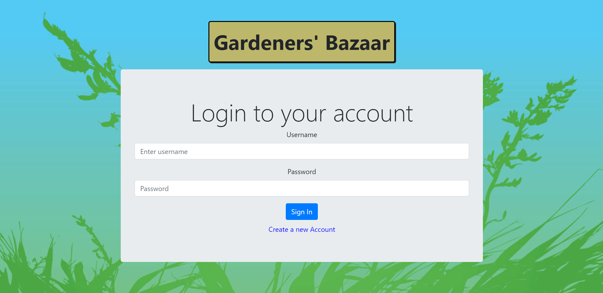
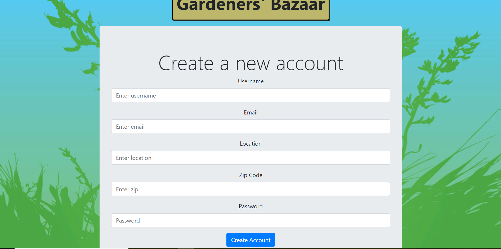
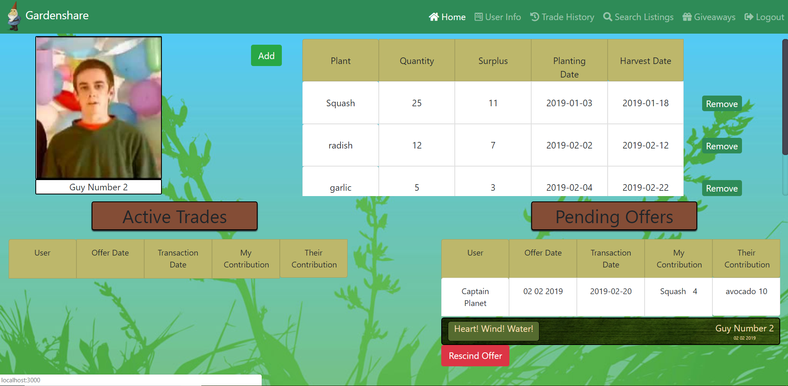
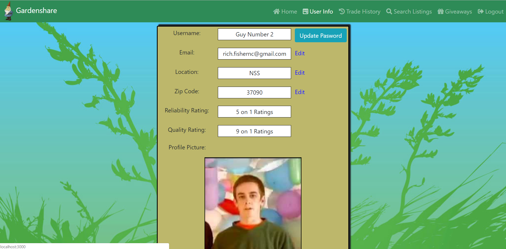
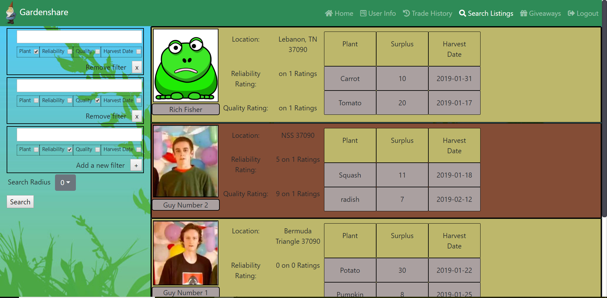

# Gardenshare

This project was built with the React framework as a 'capstone' project at Nashville Software School, a culmination of six months of front-end web-development education.

Gardenshare is a website designed to help gardeners put all their excess garden products to easy use.  After creating an account, users can select and add plants to their garden list.  A users garden list is made available to other users through the listings search feature, allowing them to view the surplus garden goods of other users around them.  Users can further narrow or expand their searches through use of multiple search filters.  

Users can then propose a trade of goods with other gardeners, allowing them to make use of excess planting.  Viewers will see a list of all pending and active trades on their home page, inspectable for additional details.  Within the individual trade interface, users are also presented with a message list for that particular trade with the option to add additional communication. 

Upon completing a trade users are prompted with an interface to rate the other gardener on the quality of their products and their reliability to deliver as promised.  Ratings are stored and presented for each user on their user listings.

A user info page is also available allowing users to change and update their account information.

Upcoming features include a page allowing users to offer and take part in garden giveaways, a trade history screen, and the ability for users to add photos of their plants to their plants' listings.

## Screenshots

Login

Create an account

User home page

User info page

Listings search page

## Site Link

https://gardenshare-890ac.firebaseapp.com/

## How to run this project locally

1. After cloning the repository, within your terminal, npm install.

2. Create a new file called apiKeys.js within the data folder and copy in the format from apiKeys.example.

3. If you do not have a Google firebase account, make one now.

4. On the firebase console, create a new project.

5. Copy the config object from the firebase project main menu and place it within the firebaseKeys section of your apiKeys file.

6. Create a new realtime database within your firebase project with default set to public.

7. Copy the following into the rules section of your database:

{
  "rules": {
    ".read": true,
    ".write": true,
    "users": {
      ".indexOn": ["uid", "location", "userName"]
    },
    "emails": {
      ".indexOn": "userName"
    },
    "plants": {
      ".indexOn": "user"
    },
    "tradeRequests": {
      ".indexOn": ["user1", "user2", "marker"]
    },
    "pictureRef": {
      ".indexOn": "userName"
    },
    "messages": {
      ".indexOn": "tradeId"
    },
    "giveAways": {
      ".indexOn": ["completed", "zipcode"]
    }
  }
}

8. Import the !base.json file from the db folder into your database.

9. Optionally, if you want some additional default data, now copy the other json files from db into their respective indexes in the firebase database.

10. You cannot use the zip-code search api locally.  Comment out lines 66, 67, and 90 from searchListings.js and place your zipcode within the getListingsByZipcode function on line 68 to bypass this functionality.

## How to deploy this project

Follow the steps in 'How to run this project locally' but skip step 10.

11. Within your terminal, firebase init.

12. Select yes for create a new project

13.  Select hosting from the selection menu.

14.  Type 'build/' when prompted for a root directory.

15. Select yes for configure as a single page app.

16.  After firebase init is completed, in your terminal, npm run deploy.

17.  Register for an apiKey at zipcodeapi.com. 

18. In app management, add the domain name for your deployed project to your apikey and save.

19. Copy the domain-specific apikey given and place in the zipcodeapi section of your apiKeys.js file.

This project was bootstrapped with [Create React App](https://github.com/facebook/create-react-app).

## Available Scripts

In the project directory, you can run:

### `npm start`

Runs the app in the development mode. 
Open [http://localhost:3000](http://localhost:3000) to view it in the browser.

The page will reload if you make edits. 
You will also see any lint errors in the console.

### `npm test`

Launches the test runner in the interactive watch mode. 
See the section about [running tests](https://facebook.github.io/create-react-app/docs/running-tests) for more information.

### `npm run build`

Builds the app for production to the `build` folder. 
It correctly bundles React in production mode and optimizes the build for the best performance.

The build is minified and the filenames include the hashes. 
Your app is ready to be deployed!

See the section about [deployment](https://facebook.github.io/create-react-app/docs/deployment) for more information.

### `npm run eject`

**Note: this is a one-way operation. Once you `eject`, you can’t go back!**

If you aren’t satisfied with the build tool and configuration choices, you can `eject` at any time. This command will remove the single build dependency from your project.

Instead, it will copy all the configuration files and the transitive dependencies (Webpack, Babel, ESLint, etc) right into your project so you have full control over them. All of the commands except `eject` will still work, but they will point to the copied scripts so you can tweak them. At this point you’re on your own.

You don’t have to ever use `eject`. The curated feature set is suitable for small and middle deployments, and you shouldn’t feel obligated to use this feature. However we understand that this tool wouldn’t be useful if you couldn’t customize it when you are ready for it.

## Learn More

You can learn more in the [Create React App documentation](https://facebook.github.io/create-react-app/docs/getting-started).

To learn React, check out the [React documentation](https://reactjs.org/).

### Code Splitting

This section has moved here: https://facebook.github.io/create-react-app/docs/code-splitting

### Analyzing the Bundle Size

This section has moved here: https://facebook.github.io/create-react-app/docs/analyzing-the-bundle-size

### Making a Progressive Web App

This section has moved here: https://facebook.github.io/create-react-app/docs/making-a-progressive-web-app

### Advanced Configuration

This section has moved here: https://facebook.github.io/create-react-app/docs/advanced-configuration

### Deployment

This section has moved here: https://facebook.github.io/create-react-app/docs/deployment

### `npm run build` fails to minify

This section has moved here: https://facebook.github.io/create-react-app/docs/troubleshooting#npm-run-build-fails-to-minify
